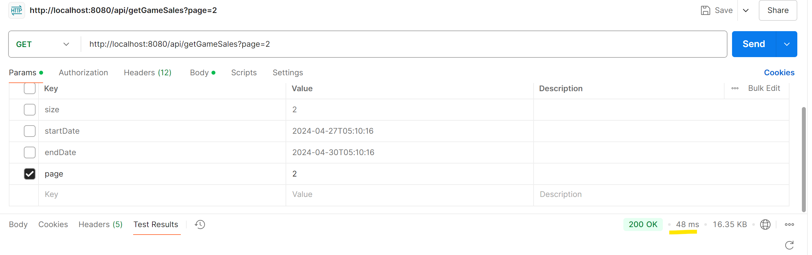
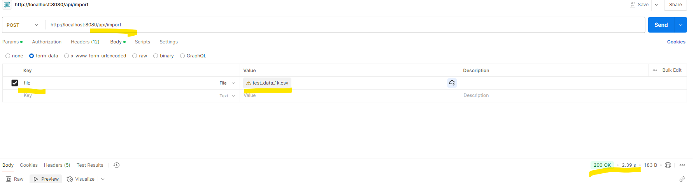

Before starting the build
1) Please modify application.yml
	- username	
	- password
2) Please run the sql file under 
	- resource/data.sql
	- resource/schema.sql

Results of the endpoint
1) To test for the endpoint /getGameSales
   i) http://localhost:8080/api/getGameSales?page=2
      - 
   ii) http://localhost:8080/api/getGameSales?page=1&size=2&startDate=2024-04-27T05:10:16&endDate=2024-04-30T05:10:16
2) To test for endpoint /getTotalSales
   i) http://localhost:8080/api/getTotalSales?startDate=2024-04-27T05:10:16&endDate=2024-04-30T05:10:16
3) To test for endpoint /import
   i) refer to the ss below
     